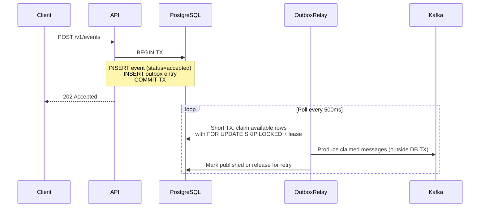
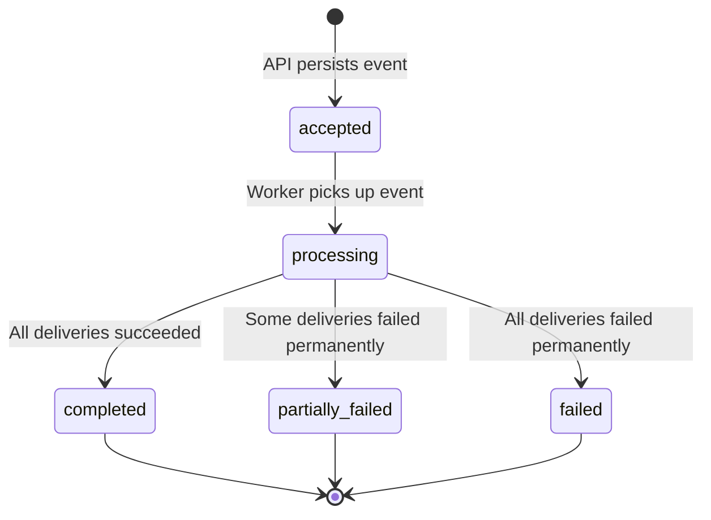
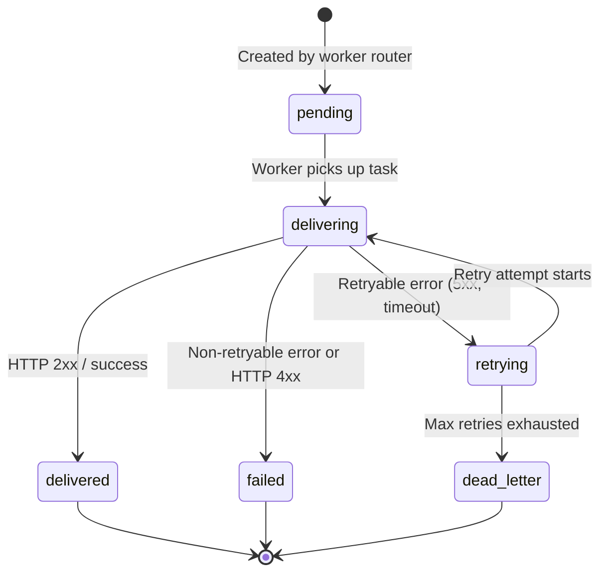

# PulseFlow — Revised Architecture & Design Document

---

## 1. Architectural Style: Modular Monolith

PulseFlow is a **single Go codebase** producing a **single binary**. The binary supports a `--mode` flag:

| Mode | What Runs | Use Case |
|---|---|---|
| `all` | API + Outbox Relay + Kafka Consumer + Delivery Dispatcher + Worker Pools | Local dev, low-traffic deployment |
| `api` | API server only | Production: scale API independently |
| `worker` | Outbox Relay + Kafka Consumer + Delivery Dispatcher + Worker Pools | Production: scale asynchronous processing independently |

Workers are **not separate codebases**. They are goroutine groups inside the same binary, sharing packages, domain models, and connection pools. In production, you run the same Docker image with different `--mode` flags.

The outbox relay is part of `worker` mode. Multiple worker processes may therefore run multiple relays; leased outbox claims and `FOR UPDATE SKIP LOCKED` make this safe. We deliberately do not introduce a separate relay service or codebase. If operationally necessary later, a `--mode=relay` role may be added to the same binary without changing the architecture.

```text
┌────────────────────────────────────────────────────────────┐
│                  pulseflow binary (--mode=all)              │
│                                                            │
│  ┌──────────────┐  ┌───────────────┐  ┌────────────────┐  │
│  │  API Server   │  │ Outbox Relay   │  │ Worker Engine  │  │
│  │  (goroutines) │  │ (goroutine)    │  │ (goroutines)   │  │
│  └──────┬───────┘  └──────┬────────┘  └──────┬─────────┘  │
│         │                  │                   │            │
│         ▼                  ▼                   ▼            │
│  ┌──────────────────────────────────────────────────────┐  │
│  │  Shared: Config, DB Pool, Redis, Kafka, Logger       │  │
│  └──────────────────────────────────────────────────────┘  │
└────────────────────────────────────────────────────────────┘
```

### Why not microservices?

- One codebase means one type system, one set of domain models, one deployment artifact.
- No inter-service networking, serialization mismatches, or versioning overhead.
- The `--mode` flag gives us independent scaling without independent codebases.
- If true service separation becomes necessary later, the internal package boundaries are the natural extraction seams.

### Architectural Invariants

The implementation must preserve these rules:

1. PostgreSQL is authoritative for accepted events, routing decisions, delivery state, retries, and terminal outcomes.
2. No request path performs a PostgreSQL write and a Kafka publish as independent operations; every Kafka message originates from an outbox row.
3. Kafka delivery and downstream HTTP delivery are both at-least-once. Correctness comes from idempotent database transitions and stable delivery identifiers, not an exactly-once claim.
4. A Kafka offset is committed only after the corresponding routing work is durable in PostgreSQL.
5. External network I/O never occurs while holding PostgreSQL row locks or an open database transaction.
6. In-memory channels bound concurrency but never serve as the only copy of pending work.
7. Redis may accelerate or protect a hot path, but loss of Redis cannot lose accepted events or corrupt state.
8. All runtime roles are built from the same source tree and Docker image.

---

## 2. Transactional Outbox Pattern

### The Problem with Direct Kafka Publish

The original design persisted an event to PostgreSQL, then published to Kafka. If the Kafka publish fails after the DB commit, we have a persisted event that never gets processed. If we publish first and the DB write fails, we process an event that doesn't exist. This is the dual-write problem.

### The Solution

We eliminate the dual-write by using a **transactional outbox**:



**Key invariant**: The event row and the outbox row are written in the **same database transaction**. Either both exist or neither does. PostgreSQL is the single source of truth.

The **Outbox Relay** is a goroutine that polls the outbox table and publishes to Kafka. If Kafka is down, the outbox accumulates. When Kafka recovers, the relay catches up. No events are lost.

The relay must not hold a PostgreSQL transaction open while performing Kafka network I/O. It first claims rows in a short transaction by assigning a lease, commits that transaction, publishes outside the transaction, and then marks successful rows as published. If the process crashes, the lease expires and another relay can reclaim the rows.

### Outbox Table

```sql
CREATE TABLE outbox (
    id             BIGSERIAL PRIMARY KEY,
    aggregate_id   UUID         NOT NULL,  -- the event ID
    topic          VARCHAR(255) NOT NULL,  -- target Kafka topic
    partition_key  VARCHAR(255) NOT NULL,  -- normally tenant_id
    payload        JSONB        NOT NULL,  -- versioned message envelope
    status         VARCHAR(20)  NOT NULL DEFAULT 'pending',
    publish_attempts INT        NOT NULL DEFAULT 0,
    available_at   TIMESTAMPTZ  NOT NULL DEFAULT now(),
    locked_by      VARCHAR(255),
    locked_until   TIMESTAMPTZ,
    last_error     TEXT,
    created_at     TIMESTAMPTZ  NOT NULL DEFAULT now(),
    published_at   TIMESTAMPTZ,
    CHECK (status IN ('pending', 'publishing', 'published'))
);
CREATE INDEX idx_outbox_available ON outbox(available_at, created_at)
    WHERE status <> 'published';
```

A claim selects only rows that are due and either pending or protected by an expired publishing lease:

```sql
SELECT id
FROM outbox
WHERE available_at <= now()
  AND (
      status = 'pending'
      OR (status = 'publishing' AND locked_until < now())
  )
ORDER BY created_at, id
LIMIT $1
FOR UPDATE SKIP LOCKED;
```

The same short transaction updates those IDs to `publishing`, assigns `locked_by`/`locked_until`, and increments `publish_attempts`.

### Outbox Relay Design

```go
// Conceptual design: ClaimBatch uses a short DB transaction and a lease.
func (r *OutboxRelay) Run(ctx context.Context) error {
    ticker := time.NewTicker(r.pollInterval) // default 500ms
    defer ticker.Stop()

    for {
        select {
        case <-ctx.Done():
            return ctx.Err()
        case <-ticker.C:
            batch, err := r.store.ClaimBatch(ctx, r.instanceID, r.batchSize, r.leaseDuration)
            if err != nil {
                r.logger.Error("outbox fetch failed", "error", err)
                continue // retry next tick
            }
            if len(batch) == 0 {
                continue
            }
            if err := r.producer.PublishBatch(ctx, batch); err != nil {
                r.logger.Error("kafka publish failed", "error", err)
                _ = r.store.ReleaseForRetry(ctx, batch, err)
                continue
            }
            if err := r.store.MarkPublished(ctx, r.instanceID, batch); err != nil {
                // Messages may be re-published → consumer must be idempotent
                r.logger.Error("mark published failed", "error", err)
            }
        }
    }
}
```

**At-least-once guarantee**: If `MarkPublished` fails after Kafka publish succeeds, the relay will re-publish the same messages. The Kafka consumer must handle duplicates by checking the event's current state in PostgreSQL.

Outbox rows are operational records, not permanent event history. Published rows should be deleted or archived by a bounded retention job after a configured period. Alerts should cover the oldest pending row, pending row count, and repeated publish failures.

---

## 3. Explicit State Machines

### Event State Machine



| State | Meaning | Transitions To |
|---|---|---|
| `accepted` | Event persisted, outbox entry created, not yet consumed by workers | `processing` |
| `processing` | Worker has begun dispatching notifications | `completed`, `partially_failed`, `failed` |
| `completed` | All delivery attempts succeeded | Terminal |
| `partially_failed` | At least one delivery succeeded, at least one exhausted retries | Terminal |
| `failed` | No delivery succeeded and every delivery ended in `failed` or `dead_letter` | Terminal |

An event with no matching notification rules is considered successfully processed and transitions to `completed`. Duplicate Kafka messages do not move a terminal event back into processing.

### Delivery Attempt State Machine



| State | Meaning | Transitions To |
|---|---|---|
| `pending` | Delivery task created, waiting in worker pool | `delivering` |
| `delivering` | HTTP request in flight under a time-bounded database lease | `delivered`, `failed`, `retrying` |
| `delivered` | Successfully delivered (2xx response) | Terminal |
| `failed` | Non-retryable failure (4xx, validation error) | Terminal |
| `retrying` | Failed with retryable error, scheduled for retry | `delivering`, `dead_letter` |
| `dead_letter` | All retry attempts exhausted | Terminal |

### State Transition Enforcement

State transitions are enforced at the **repository level** using PostgreSQL conditional updates:

```sql
-- Only allow accepted → processing
UPDATE events SET status = 'processing', updated_at = now()
WHERE id = $1 AND status = 'accepted';

-- If rows_affected = 0, the transition was invalid (concurrent consumer)
```

This prevents race conditions where two consumers try to process the same event.

Delivery claims use the same principle. A worker may transition only a due `pending` or `retrying` row to `delivering`, while recording `locked_by` and `locked_until`. If a worker crashes, a recovery loop moves an expired `delivering` lease to `retrying` (or directly reclaims it) without losing the task. State transitions are always persisted before Kafka offsets are committed or external work is considered complete.

---

## 4. Data Model & Transaction Boundaries

### Full PostgreSQL Schema

```sql
-- ============================================================
-- TENANTS
-- ============================================================
CREATE TABLE tenants (
    id          UUID PRIMARY KEY DEFAULT gen_random_uuid(),
    name        VARCHAR(255) NOT NULL,
    status      VARCHAR(20)  NOT NULL DEFAULT 'active',
    config      JSONB        NOT NULL DEFAULT '{}',
    created_at  TIMESTAMPTZ  NOT NULL DEFAULT now(),
    updated_at  TIMESTAMPTZ  NOT NULL DEFAULT now()
);

-- ============================================================
-- API KEYS
-- ============================================================
CREATE TABLE api_keys (
    id          UUID PRIMARY KEY DEFAULT gen_random_uuid(),
    tenant_id   UUID         NOT NULL REFERENCES tenants(id),
    key_hash    VARCHAR(64)  NOT NULL UNIQUE,
    key_prefix  VARCHAR(16)  NOT NULL,
    name        VARCHAR(255) NOT NULL,
    status      VARCHAR(20)  NOT NULL DEFAULT 'active',
    created_at  TIMESTAMPTZ  NOT NULL DEFAULT now(),
    expires_at  TIMESTAMPTZ
);
CREATE INDEX idx_api_keys_hash ON api_keys(key_hash);

-- ============================================================
-- EVENTS
-- ============================================================
CREATE TABLE events (
    id               UUID PRIMARY KEY DEFAULT gen_random_uuid(),
    tenant_id        UUID         NOT NULL REFERENCES tenants(id),
    type             VARCHAR(255) NOT NULL,
    idempotency_key  VARCHAR(255) NOT NULL,
    data             JSONB        NOT NULL,
    status           VARCHAR(20)  NOT NULL DEFAULT 'accepted',
    created_at       TIMESTAMPTZ  NOT NULL DEFAULT now(),
    updated_at       TIMESTAMPTZ  NOT NULL DEFAULT now(),
    processed_at     TIMESTAMPTZ,
    UNIQUE(tenant_id, idempotency_key),
    CHECK (status IN ('accepted', 'processing', 'completed', 'partially_failed', 'failed'))
);
CREATE INDEX idx_events_tenant_type ON events(tenant_id, type);
CREATE INDEX idx_events_tenant_created ON events(tenant_id, created_at DESC);

-- ============================================================
-- NOTIFICATION RULES
-- ============================================================
CREATE TABLE notification_rules (
    id          UUID PRIMARY KEY DEFAULT gen_random_uuid(),
    tenant_id   UUID         NOT NULL REFERENCES tenants(id),
    event_type  VARCHAR(255) NOT NULL,
    channel     VARCHAR(50)  NOT NULL,
    config      JSONB        NOT NULL,
    enabled     BOOLEAN      NOT NULL DEFAULT true,
    created_at  TIMESTAMPTZ  NOT NULL DEFAULT now(),
    updated_at  TIMESTAMPTZ  NOT NULL DEFAULT now()
);
CREATE INDEX idx_rules_lookup ON notification_rules(tenant_id, event_type)
    WHERE enabled = true;

-- ============================================================
-- DELIVERY ATTEMPTS
-- ============================================================
CREATE TABLE delivery_attempts (
    id                   UUID PRIMARY KEY DEFAULT gen_random_uuid(),
    event_id             UUID         NOT NULL REFERENCES events(id),
    notification_rule_id UUID         NOT NULL REFERENCES notification_rules(id),
    tenant_id            UUID         NOT NULL REFERENCES tenants(id),
    channel              VARCHAR(50)  NOT NULL,
    status               VARCHAR(20)  NOT NULL DEFAULT 'pending',
    attempt_number       INT          NOT NULL DEFAULT 0,
    max_attempts         INT          NOT NULL DEFAULT 5,
    next_retry_at        TIMESTAMPTZ,
    locked_by            VARCHAR(255),
    locked_until         TIMESTAMPTZ,
    request_payload      JSONB,
    response_status      INT,
    response_body        TEXT,
    error_message        TEXT,
    duration_ms          INT,
    created_at           TIMESTAMPTZ  NOT NULL DEFAULT now(),
    updated_at           TIMESTAMPTZ  NOT NULL DEFAULT now(),
    completed_at         TIMESTAMPTZ,
    UNIQUE(event_id, notification_rule_id),
    CHECK (status IN ('pending', 'delivering', 'delivered', 'failed', 'retrying', 'dead_letter')),
    CHECK (attempt_number >= 0 AND max_attempts > 0)
);
CREATE INDEX idx_delivery_event ON delivery_attempts(event_id);
CREATE INDEX idx_delivery_available ON delivery_attempts(status, next_retry_at, locked_until)
    WHERE status IN ('pending', 'retrying', 'delivering');

-- ============================================================
-- OUTBOX
-- ============================================================
CREATE TABLE outbox (
    id               BIGSERIAL PRIMARY KEY,
    aggregate_id     UUID         NOT NULL,
    topic            VARCHAR(255) NOT NULL,
    partition_key    VARCHAR(255) NOT NULL,
    payload          JSONB        NOT NULL,
    status           VARCHAR(20)  NOT NULL DEFAULT 'pending',
    publish_attempts INT          NOT NULL DEFAULT 0,
    available_at     TIMESTAMPTZ  NOT NULL DEFAULT now(),
    locked_by        VARCHAR(255),
    locked_until     TIMESTAMPTZ,
    last_error       TEXT,
    created_at       TIMESTAMPTZ  NOT NULL DEFAULT now(),
    published_at     TIMESTAMPTZ,
    CHECK (status IN ('pending', 'publishing', 'published'))
);
CREATE INDEX idx_outbox_available ON outbox(available_at, created_at)
    WHERE status <> 'published';
```

### Transaction Boundaries

Every write operation clearly defines what happens inside a transaction:

#### TX 1: Event Ingestion (API hot path)

```text
BEGIN;
  1. INSERT INTO events (...) VALUES (...);            -- persist event
  2. INSERT INTO outbox (...) VALUES (...);            -- queue for Kafka
COMMIT;
```

Both writes succeed or both fail. The API **never** talks to Kafka directly. Response is returned immediately after commit.

If `(tenant_id, idempotency_key)` already exists, the repository returns the existing event. A repeated request with the same key and equivalent payload receives the same logical result; reuse of the key with a different event type or payload is a `409 Conflict`.

#### TX 2: Event Processing Start (Worker)

```text
BEGIN;
  1. UPDATE events SET status='processing' WHERE id=$1 AND status='accepted';
     -- If 0 rows affected, inspect current state rather than blindly failing.
  2. SELECT * FROM notification_rules WHERE tenant_id=$1 AND event_type=$2 AND enabled=true;
  3. INSERT INTO delivery_attempts (...) VALUES (...), (...), ...
     ON CONFLICT (event_id, notification_rule_id) DO NOTHING;
     -- One durable row per matching rule; safe on Kafka redelivery.
  4. If no rules match, UPDATE events SET status='completed', processed_at=now().
COMMIT;
```

The Kafka offset is committed **after TX 2 commits**, because the delivery work is now durable in PostgreSQL. It is not held open while downstream webhooks execute. If the event is already `processing`, the consumer verifies that its delivery rows exist and safely resumes; if it is terminal, the duplicate message is acknowledged without changing state.

#### TX 3: Delivery Claim (Dispatcher)

```text
BEGIN;
  1. SELECT due pending/retrying rows, plus expired delivering leases,
     ORDER BY next_retry_at, created_at
     LIMIT $batch_size FOR UPDATE SKIP LOCKED;
  2. UPDATE selected rows SET status='delivering', locked_by=$worker_instance,
     locked_until=now()+$lease_duration, updated_at=now();
COMMIT;
```

Claiming is a short database transaction. External HTTP calls never occur while database row locks are held. The dispatcher submits claimed rows to bounded in-memory worker pools; the database lease remains the recovery mechanism if a process exits after claiming.

#### TX 4: Delivery Result (Worker)

```text
UPDATE delivery_attempts
SET status=$1, response_status=$2, response_body=$3,
    error_message=$4, duration_ms=$5,
    attempt_number=attempt_number+1,
    next_retry_at=$6, completed_at=$7,
    locked_by=NULL, locked_until=NULL, updated_at=now()
WHERE id=$8 AND status='delivering' AND locked_by=$worker_instance;
```

Retryable failures become `retrying` with a persisted `next_retry_at`. Non-retryable failures become `failed`. When the maximum attempt count is reached, the row becomes `dead_letter`, and its dead-letter Kafka message is written through the outbox rather than published as a new dual write.

#### TX 5: Event Finalization (Worker)

```text
BEGIN;
  1. SELECT status FROM delivery_attempts WHERE event_id=$1 FOR SHARE;
     -- Do not finalize while any row is pending, delivering, or retrying.
  2. UPDATE events SET status=$computed_status, processed_at=now()
     WHERE id=$1 AND status='processing';
COMMIT;
```

Final status is computed deterministically: all delivered (or no matching rules) is `completed`; a mixture of delivered and failed/dead-letter rows is `partially_failed`; no successful deliveries is `failed`.

---

## 5. Redis: Justified Uses

PostgreSQL is the **sole source of truth**. Redis is used only where PostgreSQL cannot provide the required performance characteristics, and each use has a defined fallback.

### Use 1: API Rate Limiting

| | |
|---|---|
| **Why Redis?** | Rate limiting needs atomic increment-and-compare in <1ms per request. PostgreSQL `UPDATE ... RETURNING` on a hot row would cause lock contention at high request rates. |
| **Algorithm** | Token bucket via a Lua script (`EVALSHA`) for atomicity. Token bucket over sliding window because event ingestion is naturally bursty — a checkout flow may fire 10 events in 1 second, then nothing for 30s. Token bucket absorbs these bursts gracefully, while a sliding window would reject legitimate traffic. |
| **Key** | `rl:{tenant_id}` |
| **TTL** | Bucket refill interval (e.g., 60s) |
| **Fallback** | If Redis is unavailable: **fail-open** (allow request, log warning). Rate limiting is a protection mechanism, not a correctness requirement. The API remains functional. |

### Use 2: API Key Cache

| | |
|---|---|
| **Why Redis?** | Every API request requires key validation. Hitting PostgreSQL on every request adds ~2-5ms latency and unnecessary load. The API key table is small but read extremely frequently. |
| **Key** | `apikey:{sha256_hash}` → `{tenant_id, status}` |
| **TTL** | Configurable, default 60 seconds |
| **Fallback** | If Redis is unavailable: query PostgreSQL directly. Adds latency but remains correct. |
| **Invalidation** | On key revocation, delete the cache entry. If deletion cannot be confirmed, revocation may be delayed only until the short TTL expires. This bounded staleness is an explicit security tradeoff. If immediate revocation becomes a requirement, PostgreSQL status must be checked on every request or a stronger invalidation protocol must be designed. |

### What is NOT in Redis

| Concern | Why PostgreSQL instead |
|---|---|
| **Idempotency** | The `UNIQUE(tenant_id, idempotency_key)` constraint on the `events` table provides the idempotency guarantee atomically within the same transaction as event insertion. No need for a separate Redis check — the DB constraint catches duplicates, and the transaction rolls back cleanly. |
| **Event state** | PostgreSQL is the source of truth. Caching delivery state in Redis adds consistency risk with no meaningful benefit. |
| **Outbox** | The outbox table IS the Kafka publish queue. Moving it to Redis would lose durability. |

---

## 6. Failure Handling

### Failure Matrix

| Component Down | Impact | System Behavior | Recovery |
|---|---|---|---|
| **PostgreSQL** | Cannot persist events or read durable work | API returns `503 Service Unavailable`. Consumers do not commit offsets. Dispatchers stop claiming work. Readiness fails, but liveness normally stays healthy to avoid restart loops. | Retry connections with bounded backoff. On reconnect, durable state resumes processing. |
| **Redis** | Rate limiting and API key cache unavailable | Rate limiting: fail-open (log warning, allow request). API key auth: falls back to PostgreSQL query. System remains functional with degraded performance. | On reconnect: cache repopulates naturally via TTL expiry reads. |
| **Kafka** | Outbox relay cannot publish messages | Outbox rows accumulate in PostgreSQL. API continues accepting events while database capacity permits. Alerts fire on backlog age/size. | On reconnect, leased relays drain available rows. Ordering is Kafka partition arrival order, not a strict database creation-order guarantee across relay instances. |
| **Downstream webhook** | Delivery fails | Retry network failures, timeouts, HTTP `408`, `429`, and `5xx` with exponential backoff plus jitter; honor `Retry-After`. Other `4xx` responses are normally permanent `failed` results. Exhausted retries become `dead_letter`. | Due retries remain durable in PostgreSQL and are reclaimed when the provider recovers. |
| **Worker crash** | In-flight HTTP calls are interrupted | Kafka routing work is already represented by durable delivery rows. Claimed rows remain `delivering` only until their lease expires. | A recovery dispatcher reclaims expired leases; uniqueness constraints prevent duplicate logical deliveries. Providers should receive an idempotency identifier because an HTTP result can be ambiguous after a crash. |
| **Outbox relay crash** | Outbox stops draining on that instance | Claimed rows remain durable and become eligible when their lease expires. | Another relay or the restarted process reclaims them. A message may be published twice, so consumers remain idempotent. |
| **Poison Kafka message** | Message cannot be decoded or validated | Persist/publish a quarantine record to `events.deadletter`, then commit the source offset. Never silently log-and-drop. | Operators inspect and replay corrected messages explicitly. |

### Backpressure Chain

```text
Downstream slow → Worker pool channel fills → PostgreSQL dispatcher
  stops claiming delivery rows → due rows remain durable in PostgreSQL
  → Kafka consumer can still finish the short routing transaction
  and commit its offset

When downstream recovers → Workers drain → channel capacity opens
  → dispatcher claims more due rows → system catches up
```

This is intentional: backpressure stops at the durable PostgreSQL delivery queue. It does not require an unbounded in-memory queue, and it does not rely on a Kafka consumer remaining stalled long enough to risk consumer-group churn.

### Health Semantics

- `/healthz` is liveness: it reports whether the process and its goroutines are responsive. A dependency outage alone does not make the process dead.
- `/readyz` is readiness: API mode requires PostgreSQL; worker mode requires PostgreSQL and reports Kafka degradation. Redis failure is reported as degraded but does not make the API unready because both Redis uses have fallbacks.
- Readiness removes an instance from traffic; it must not be used as a reason for an endless dependency-outage restart loop.

---

## 7. Worker Pool Design

### Architecture

```go
type WorkerPool struct {
    name     string
    tasks    chan DeliveryTask    // bounded channel = backpressure mechanism
    workers  int                  // configurable per channel type
    wg       sync.WaitGroup
    intakeCtx context.Context       // stops new submissions
    workCtx   context.Context       // cancelled only on drain timeout
    cancelWork context.CancelFunc
    handler  DeliveryHandler      // webhook, email, etc.
    metrics  *WorkerMetrics
}
```

### Five Design Properties

**1. Bounded concurrency** — The channel buffer size and worker count cap maximum in-flight work:

```go
pool := &WorkerPool{
    tasks:   make(chan DeliveryTask, cfg.BufferSize), // e.g., 100
    workers: cfg.WorkerCount,                         // e.g., 10
}
```

At most `WorkerCount` deliveries execute concurrently. At most `BufferSize` additional tasks queue.

**2. Backpressure** — When the channel is full, the PostgreSQL delivery dispatcher stops claiming new rows. Unclaimed work remains durable in PostgreSQL, preventing unbounded memory growth:

```go
select {
case pool.tasks <- task:
    // submitted
case <-intakeCtx.Done():
    // shutting down, reject
}
```

**3. Context cancellation** — Intake and execution use separate contexts. Stopping intake prevents new claims without immediately aborting work already in the channel. Each delivery also derives a timeout from `workCtx`:

```go
func (wp *WorkerPool) worker(workCtx context.Context) {
    defer wp.wg.Done()
    for {
        select {
        case task, ok := <-wp.tasks:
            if !ok { return }
            deliveryCtx, cancel := context.WithTimeout(workCtx, wp.deliveryTimeout)
            wp.handler.Deliver(deliveryCtx, task)
            cancel()
        case <-workCtx.Done():
            return
        }
    }
}
```

**4. Graceful shutdown** — On SIGTERM:

```text
1. Stop HTTP acceptance and stop Kafka polling / delivery claiming
2. Wait for producers of pool tasks to stop, then close task channels
3. Workers drain buffered and in-flight tasks without a global cancellation
4. Wait for `wg` until `SHUTDOWN_TIMEOUT`
5. If the deadline expires, cancel `workCtx`, log in-flight task count, and exit
6. Any unfinished delivery becomes recoverable when its PostgreSQL lease expires
```

**5. Configurable worker counts** — Different channels have different performance characteristics:

```yaml
workers:
  webhook:
    count: 20       # webhooks are I/O bound, high concurrency
    buffer: 200
    timeout: 30s
  email:
    count: 5        # email provider has its own rate limits
    buffer: 50
    timeout: 10s
```

### Delivery Semantics

Webhook delivery is at-least-once. A timeout or worker crash can occur after the provider accepted the request but before PulseFlow recorded the response. Every retry therefore sends the same stable logical delivery ID, for example in `Idempotency-Key` and `X-PulseFlow-Delivery-ID`, plus the current attempt number in `X-PulseFlow-Attempt`. Providers can use the delivery ID to deduplicate. PulseFlow does not claim exactly-once delivery across an HTTP boundary.

---

## 8. Kafka Consumer Design

```go
func (c *Consumer) Run(ctx context.Context) error {
    for {
        select {
        case <-ctx.Done():
            return ctx.Err()
        default:
        }

        msg, err := c.reader.FetchMessage(ctx)
        if err != nil {
            if errors.Is(err, context.Canceled) {
                return nil
            }
            c.logger.Error("fetch failed", "error", err)
            continue
        }

        var event EventMessage
        if err := json.Unmarshal(msg.Value, &event); err != nil {
            c.logger.Error("unmarshal failed", "error", err)
            // Persist a quarantine/dead-letter outbox row before acknowledging.
            if err := c.store.QuarantineMessage(ctx, msg, err); err != nil {
                continue // do not commit; retry until the poison message is durable
            }
            c.reader.CommitMessages(ctx, msg)
            continue
        }

        // Short DB transaction: claim event and create idempotent delivery rows.
        if err := c.routeEvent(ctx, event); err != nil {
            c.logger.Error("process failed", "error", err)
            continue // don't commit → message will be re-delivered
        }

        c.reader.CommitMessages(ctx, msg)
    }
}
```

**Offset commit strategy**: Commit only after `routeEvent` succeeds and delivery rows are durable in PostgreSQL. If the process crashes before commit, Kafka re-delivers the message. `UNIQUE(event_id, notification_rule_id)` plus conditional event transitions make routing idempotent. Downstream HTTP delivery is performed independently by the PostgreSQL delivery dispatcher and does not hold Kafka offsets open.

Kafka preserves arrival order within a partition. Partitioning by tenant keeps a tenant's messages on one partition, but multiple outbox relays can publish database rows in a different order from their creation timestamps. The system therefore guarantees at-least-once processing, not strict database-creation ordering. If a future business requirement needs strict per-tenant ordering, it must be designed explicitly with tenant sequence numbers and consumer-side sequence enforcement.

---

## 9. Authentication Design

**API Key with SHA-256 hashing:**

1. On tenant creation, generate 32 random bytes → base62 encode → prefix with `pf_live_`
2. Store `SHA-256(raw_key)` and a display prefix containing `pf_live_` plus the first unique token characters in `api_keys`; do not store only the common `pf_live_` prefix
3. Return raw key to client **once** — never stored or retrievable
4. Client sends: `Authorization: Bearer pf_live_...`
5. Server computes `SHA-256(bearer_token)`, checks Redis cache → PostgreSQL fallback, and uses constant-time comparison where application-side hash comparison is required

---

## 10. Kafka Topic Design

| Topic | Purpose | Partition Key | Partitions | Retention |
|---|---|---|---|---|
| `events.ingested` | Events ready for processing | `tenant_id` | 12 | 7 days |
| `events.deadletter` | Exhausted deliveries and quarantined poison messages | `tenant_id` when known, otherwise source partition | 6 | 30 days |

Partitioning by `tenant_id` ensures messages that have reached Kafka for the same tenant are consumed in broker arrival order by one partition consumer. It does not by itself guarantee that concurrently claimed outbox rows are published in PostgreSQL creation order.

---

## 11. Project Structure

```text
pulseflow/
├── cmd/
│   └── pulseflow/
│       └── main.go                 # Entrypoint, dependency wiring, mode selection
├── internal/
│   ├── api/
│   │   ├── server.go               # HTTP server lifecycle
│   │   ├── router.go               # Route registration
│   │   ├── middleware/
│   │   │   ├── auth.go             # API key validation
│   │   │   ├── ratelimit.go        # Token bucket rate limiter
│   │   │   └── requestid.go        # X-Request-ID injection
│   │   └── handler/
│   │       ├── event.go            # POST/GET /v1/events
│   │       └── health.go           # /healthz, /readyz
│   ├── domain/
│   │   ├── event.go                # Event model + state machine
│   │   ├── tenant.go               # Tenant model
│   │   ├── notification.go         # NotificationRule + DeliveryAttempt models
│   │   └── errors.go               # Domain error types
│   ├── store/
│   │   ├── postgres/
│   │   │   ├── event_repo.go       # Event CRUD + state transitions
│   │   │   ├── tenant_repo.go      # Tenant + API key queries
│   │   │   ├── notification_repo.go # Rules + delivery attempt CRUD
│   │   │   ├── outbox_repo.go      # Leased outbox claim/release/publish
│   │   │   └── migrations/         # SQL migration files
│   │   └── redis/
│   │       ├── ratelimiter.go      # Token bucket rate limiter
│   │       └── cache.go            # API key cache
│   ├── queue/
│   │   ├── producer.go             # Kafka producer
│   │   ├── consumer.go             # Kafka consumer loop
│   │   └── outbox_relay.go         # Outbox → Kafka relay goroutine
│   ├── worker/
│   │   ├── pool.go                 # Bounded worker pool
│   │   ├── router.go               # Kafka event → durable delivery rows
│   │   ├── dispatcher.go           # Claim due delivery rows and submit to pools
│   │   ├── recovery.go             # Reclaim expired delivery leases
│   │   ├── finalizer.go            # Compute terminal event status
│   │   ├── retry.go                # Persist retry schedule + dead letter outbox
│   │   ├── webhook/
│   │   │   └── deliverer.go        # HTTP POST with timeout
│   │   └── email/
│   │       └── deliverer.go        # Simulated email delivery
│   └── config/
│       └── config.go               # Envconfig-based configuration
├── migrations/
│   ├── 001_initial_schema.up.sql
│   └── 001_initial_schema.down.sql
├── docker-compose.yml
├── Dockerfile
├── Makefile
└── go.mod
```

---

## 12. Local Development

```text
docker-compose up -d    →  PostgreSQL, Redis, Kafka, Zookeeper
go run ./cmd/pulseflow   →  Runs with --mode=all (default)
```

The Go process runs on the host for fast iteration. All infrastructure runs in Docker.

The Go version in `go.mod`, the Docker builder image, and CI must be identical. Dependency resolution must generate and commit `go.sum` before the Dockerfile copies it.

Tenant, API-key, and notification-rule provisioning is an administrative concern. The initial implementation will use a small authenticated admin CLI or seed command in the same binary rather than exposing unauthenticated public setup endpoints. Public admin APIs are out of scope until their authorization model is designed.

---

## 13. Technology Justification

| Technology | Purpose | Why essential |
|---|---|---|
| **Go** | Application | Concurrency model, single binary, performance |
| **PostgreSQL** | Source of truth | ACID transactions, JSONB, outbox pattern, mature |
| **Redis** | Rate limiting + API key cache | Sub-ms latency for hot-path operations that would bottleneck PG |
| **Kafka** | Async processing backbone | Durable, partitioned, consumer groups for horizontal scaling |
| **Chi** | HTTP router | Lightweight, stdlib-compatible, composable middleware |
| **pgx** | PG driver | Native Go, connection pooling, high performance |
| **golang-migrate** | DB migrations | SQL-based, simple, version-controlled |

No additional technologies are included in the initial architecture. Structured logs and internal counters are implemented first. An external metrics or tracing backend is added only when deployment requirements identify a concrete operator and retention model; OpenTelemetry or Prometheus are not assumed dependencies merely because they are common choices.

---

## Proposed Implementation Order

| Phase | Scope | Depends On |
|---|---|---|
| **1** | Go module, project scaffold, Docker Compose, config, migrations | — |
| **2** | Corrected schema, domain state machines, leased claims, PostgreSQL repositories | Phase 1 |
| **3** | API server, auth middleware, rate limiting, event ingestion | Phase 2 |
| **4** | Leased outbox relay, Kafka producer, idempotent routing consumer, poison-message quarantine | Phase 1+2 |
| **5** | Delivery dispatcher, bounded pools, lease recovery, webhook + email delivery, durable retry, finalization | Phase 3+4 |
| **6** | Structured operational metrics, backlog/lease alerts, tracing only if required | Phase 5 |
| **7** | Corrected Docker image, deployment manifests, CI/CD, resilience testing | Phase 6 |

## Verification Plan

### Per-Phase Automated Tests
- **Phase 1**: `go build ./...` compiles; `docker-compose up` starts all infra
- **Phase 2**: Unit tests for every allowed/forbidden transition; repository integration tests for uniqueness, concurrent claims, lease expiry, and finalization
- **Phase 3**: HTTP integration tests for auth fallback, rate limiting fail-open behavior, event ingestion, same-payload idempotency, and conflicting idempotency-key reuse
- **Phase 4**: Outbox tests covering Kafka outage, relay crash after publish, duplicate publication, multiple relays, poison messages, and offset commit only after durable routing
- **Phase 5**: End-to-end delivery test plus slow-provider backpressure, retry classification, `Retry-After`, worker crash with lease recovery, graceful drain, forced-timeout shutdown, dead-letter creation, and `go test -race ./...`

### Manual Verification
- After Phase 3: provision a tenant/key/rule with the admin command, send events, and verify same-payload and conflicting-payload idempotency behavior
- After Phase 5: Send events, verify webhook delivery, inject failures, verify retry + dead letter
